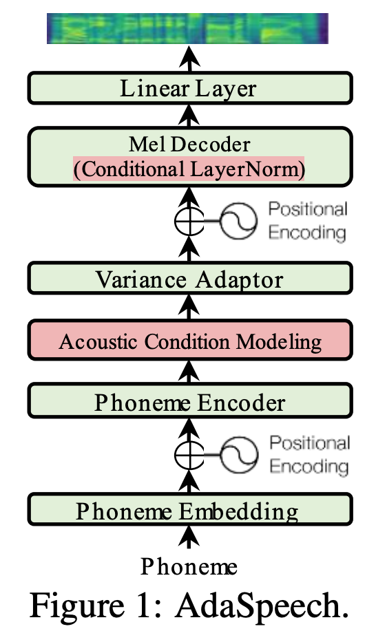

# AdaSpeech: Adaptive Text to Speech for Custom Voice

Microsoft Research Asia, Microsoft Azure Speech

[논문링크](https://arxiv.org/pdf/2103.00993.pdf)

[Audio samples](https://speechresearch.github.io/adaspeech/)

## Abstract

* challenges for TTS adaptation
  * source TTS data와 adapatation할 데이터의 음향적 특성이 매우 다르다.
    * source TTS data : pretrain한 데이터
  * 많은 소비자에게 서비스를 제공하려면, 즉, 여러가지 목소리로 adapataion되기 위해서는 adaptation 파라미터는 충분히 작으면서도 높은 음성 품질을 유지할 수 있어야 한다.
    * adaptation parameters : target speaker에 대해 adapatate하기 위해 수정해야 하는 파라미터들
    * 그렇지 않으면 스피커가 늘어날 때마다 memory usage가 올라갈 것이다.
* 본문에서 위의 두가지 문제를 해결한 방법
  * 음향 정보를 utterance level과 phoneme level 두 층위에서 모델링한다. 
    * 훈련할 때는 utterance level vector를 추출하는 acoustic encoder와 phoneme level vector sequence를 추출하는 acoustic encoder 두가지를 사용한다. 
    * 추론 시에는 레퍼런스 스피치로부터 utterance level vector를 추출하고, acoustic predictor가 phoneme level vector를 predict 한다. 
  * mel-spectrogram decoder에 conditional layer normalization을 적용하여 적은 메모리로도 adaptation이 가능하도록 한다.
* pretrain에는 LibriTTS 데이터셋을 사용하고, VCTK, LJspeech로 Fine-tune(adaptation)하였다.
  * adaptation은 20 문장으로 약 1분 정도의 분량을 사용하였다. 

## Model Architecture

* custom voice adaptation을 위해 FastSpeech를 수정하였다.
  * acoustic condition modeling
    * adaptation speech의 다양한 acoustic condition을 여러가지 층위로 capture하기 위한 부분
  * conditional layer normalization in decoder 
    * 효율적인 adaptation

#### Acoustic Condition Modeling

* Custom voice는 source speech data와 acoustic condition이 달라서, source TTS model의 adaptability(generalizability)를 improve해야한다. 

  * 이는 데이터로 해결할 수 없다. 모든 acoustic condition을 cover하는 data를 구성할 수 없다. 
  * 그런데, TTS에서 input인 text는 acoustic condition을 모델링하기에는 그 정보가 충분하지 않다. 때문에 모델은 훈련 데이터를 memorize하고 overfit하는 경향이 있다. 이로 인해 adapation을 할 때 TTS 모델의 generalizability가 떨어진다.
  * 본 논문에서 제시하는 해결방안은 Input으로 acoustic condition을 제공하는 것이다. 

* 더 나은 granularity를 위해 acoustic condition을 3가지로 나눈다.

  * ~~윗부분에서는 층위?로 해석하였는데, 아닐지도~~
  * speaker level: coarse-grained, speaker의 전반적인 특징 
  * utterance level: fine-grained
  * Phoneme level: more-fine-grained, 특정 phoneme의 accents, pitches, prosodies, and temporal environment noises

* 3가지 acoustic condition은 다음과 같은 방법으로 추출한다.

  

  * speaker level: speaker embedding
  * utterance level
    * acoustic encoder가 single vector를 추출하고, phoneme hidden sequence에 맞춰 expand한다.
    * acoustic encoder 는 convolution layer와 mean pooling layer로 이루어져있다.
  * phoneme level
    * 먼저, alignment에 따라 같은 phoneme의 speech frame을 avearge한다. (Phoneme-level Mel)
    * target speech로 부터 뽑은 phoneme-level vector를 phoneme hidden sequence에 더한다.

* speech encoder로 speech seqeucne의 특징을 표현하는 vector를 추출하는 것은 이전 연구에서도 많이 사용한 방법이다. 본 논문에서 제시한 방법의 이전 연구와 다른 점은 다양한 granularities를 고려하여 acoustic modeling을 행한다는 것이다. 

#### conditional layer normalziation

* 효율적인 adaptation을 위해서 source TTS model의 Layer normalization 부분만 update한다.

* layer normalization만 adaption하는 이유

  * FastSpeech2는 트랜스포머 구조로 이루어져있는데, 트랜스포머 구조에서 attention과 FFN의 matrix multiplication은 모두 parameter intensive하다.
  * 때문에 효율적인 adaptation을 하기에는 부적합하다.
  * 반면에 layer normalization은 parameter가 적으면서도 hidden activation와 final prediction에 많은 영향을 끼친다. 
  * 때문에 적은 파라미터를 update하면서도 adaptation이 가능하다.

  

  *  특정 speaker의 특징을 작은 conditional network를 이용하여 layer normalization의 scale, bias vector로 만들 수 있다면

  * 새로운 목소리에 adaptation할 때 이 small network만 finetune하면 될 것이다.

  * 위의 그림을 식으로 나타내면 다음과 같다. 

    

    * s : speaker id
    * c : C conditional layer normalizations in the decoder

#### pipeline of adaspeech

* pretrain : Adaspeech를 데이터 D로 훈련한다.
* finetune : 새로운 speaker에 대해 conditional layer normalization을 fine-tune한다.
* inference : pretrain한 모델 부분과 finetune한 부분을 합쳐서 추론한다.

## Experiment

#### datasets

* source TTS model 훈련 데이터 : LibriTTS
  * Multi-speaker, 586 hours
  * adaptation을 위해 일부 speaker에 해당 데이터를 제외하고 모두 학습에 사용하였다.
* fine-tune 데이터 : VCTK, LJspeech, LibriTTS(일부분)
  * speaker를 random하게 골라서 20문장으로 adaptation을 진행한다.
* 16kHz로 변환해서 사용
* Mel-spectrogram converter: 12.5ms hop size, 50ms window size
* text -> g2p 거쳐서 phoneme 사용

#### model configuration

* 4 FFN Transformer blocks for phoneme encoder and mel-spectrogram decoder
* hidden dimension = 256
  * phoneme embedding, speaker embedding, hidden in self-attention, input and output hidden of FFN
* attention head = 2 / feed-forward filter size = 1024 /  kernel size =9
* output linear layer converts 256 dim hidden into 80-dimensional mel-spectrogram
* Phoneme-level acoustic encoder and predictor 
  * 2 convolution layers with filter size=256, kernel size=3
  * a linear layer to compress the hidden to a dimension of 4

* Utterance-level acoustic encoder
  * 2 convolution layers with filter size=256, kernel size=5, stride size=5 
  * pooling layer to obtain a single vector
* MFA for out source alignment

## Results

* ablation study

  

  * CLM : conditional layer normalization

* Acoustic modeling

  

  
