# ProsodySpeech: Towards Advanced Prosody Model for Neural Text-To-Speech

* ICASSP 2022 accepted, Microsoft
* [논문링크](https://ieeexplore.ieee.org/stamp/stamp.jsp?tp=&arnumber=9746744)

## Overview

* Expressive TTS, few-shot personalized TTS 두가지 task에 대한 advanced prosody modeling 방법을 제안하고, 이를 FastSpeech2에 적용한다.
* 이를 위해 mutual information-based style content separation 방법을 사용하는 Prosody Extractor와 attention을 활용한 Prosody distributor를 제안한다.
  * Prosody extractor가 기존 reference encoder를 대체한다.
  * 또한, inference stage에서 단 하나의 reference audio를 사용하지 않고 여러개의 reference audio를 사용하여 prosody feature의 다양성을 높이고자 하였다.
* 본 논문에서 제안한 방법은 각 task에서의 MOS 점수 측정 결과 기존 모델에 비해 성능이 향상되었음을 확인하였다. 
  * Complain style에 대해 SMOS 4.38 달성

## Abstract

* 목적: 고도로 expressive한 음성을 생성할 수 있고, 적은 훈련 데이터로도 개인화된 음성을 합성할 수 있도록 encoder-decoder neural TTS를 enhance하고자 한다.

* 이를 위해 기존 구조에 2가지를 추가한다. 

* Prosody Extractor

  * 목적 : 여러 reference speech로부터 prosody examplar set을 생성
  * 다양한 화자로 구성된 대량 코퍼스로 훈련
  * 이때 발생하는 content leakage 문제를 해결하기 위해 MIST를 사용
  * MIST: Mutual information-based style content separation

  > cf) [FGTransformer](https://arxiv.org/pdf/2110.06306.pdf) : Random truncation of style embedding을 통해 해결

* Prosody Distributor

  * 목적: attention mechanisim을 이용하여 a soft-selection of appropriate prosody exemplars in phone-level 만들기

## Introduction

* GST style 의 문제점
  * inference를 할 때 reference speech와 target speech 간의 불일치로 인해 style embedding의 effectiveness가 저하됨.
  * 실제로 해당 모델을 적용할 때 적절한 reference speech를 고르는 것을 어렵게 함
* 이 논문의 **Contribution**
  * FastSpeech2 구조에 prosody extractor와 prosody distributor를 주가하여 prosody modeling과 transfer성능을 향상시킴
  * Pre-trained prosody extractor with mutual information estimator
    * phonetic content에서 disentangle된 prosody representation을 학습
  * Prosody distributor with an attention mechanism
    * phone-level prosody representation을 얻기 위해 a soft selection of appropriate prosody exemplars를 만든다.

## Model Architecture

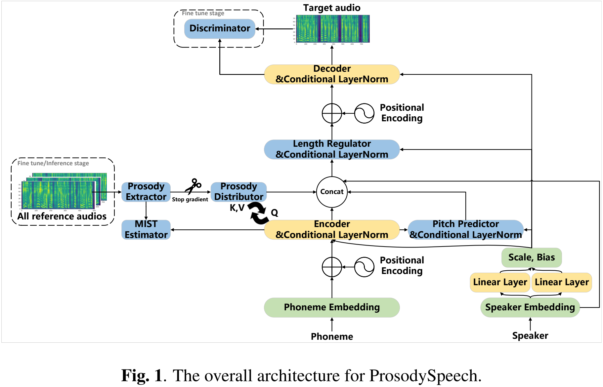

#### Encoder, Decoder

* 6 Feed-Forward Transformer blocks with conditional layer normalization
  * Encoder: 384 hidden units
  * Decoder: 1536 hidden units
  * number of attention head = 4 / attention dim = 384
* Encoder 
  * input: 512 dim phoneme embedding with Positional Encoding -
  * output : F_context (phone-level context feature)
* Decoder
  * input : upsampled frame level F_context + F_prosody (expanded prosody feature) + F_pitch + F_speaker
  * output : mel-spectrogram

#### Conditional Layer Normalization

* 참고자료: [AdaSpeech](https://arxiv.org/pdf/2103.00993.pdf)

* AdaSpeech는 새로운 목소리에 대해 효율적이고 고성능의 customization을 위한 adaptive TTS system을 제안한다.

* customization이 효율적이기 위해 conditional layer normalization을 제안한다.

* High voice quality를 유지하면서도 메모리 사용량을 최대한 줄일 수 있는 adaptation parameter 개수

* 이를 위해 Mel-spectrogram decoder의 layer normalization을 수정한다. 
  * 이때, speaker embedding을 Layer normalization에서의 scale, bias vector를 생성하기 위한 conditional information으로 사용한다.
  * fine tuning할 때는 conditional layer normalization과 관련된 Parameter만 adpat되도록 한다.
  
* Why modify layer normalization?

  * Transformer block에서 adapt할 parameter를 정해야 한다. (FastSpeech2가 tranformer 기반이니까)
  * 그런데, Matrix multiplicatoin과 two-layer FFN은 너무 parameter intensive하여 효율적인 adaptation이 될 수 없다.
    * what do you mean by "parameter intensive"?

  * Layer normalization은 scale vector와 bias vector만으로도 hidden activation과 final prediction에 큰 영향을 미칠 수 있다. 
    * LN(x) =γ (x-μ)/σ + β 
    * γ : scale vector, β : bias vector

  * 때문에 small conditional network를 이용하여 speaker characteristics로 γ, β 를 정할 수 있으면 
  * 새로운 목소리로 adaptation을 할 때 그 비용을 줄이면서도 좋은 품질의 음성을 유지할 수 있다. 

  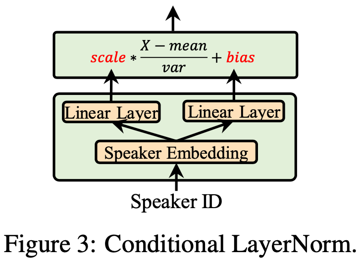

#### Length Regulator, Pitch Predictor

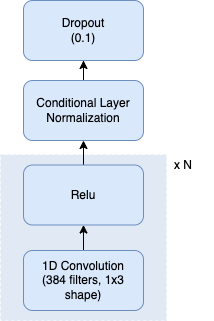

* Length Regulator: Ground Truth phoneme duration을 사용해서 phone-level F_context를 frame-level F_context로 upsample
* Pitch predictor: 훈련 시 predicted phone-averaged F_pitch with Tanh activation을 사용
  * 해당 F_pitch는 F_context와 합쳐짐

#### Prosody Extractor and MIST estimator

* Prosody Extractor : GST의 reference encoder

  * 4개의 FFT blocks로 구성

* reference encoder의 문제점인 context leakage 문제를 해결하기 위해 MIST estimator를 사용

* MIST estimator

  * Donsker-Varadhan representation of KL divergence에 기반한 mutual information의 lower bound를 형성

  * 2 linear layers with 512 hidden units -> Elu(Exponential Linear Unit) activation -> 1 linear layer with 1 hidden unit -> Tanh activation

    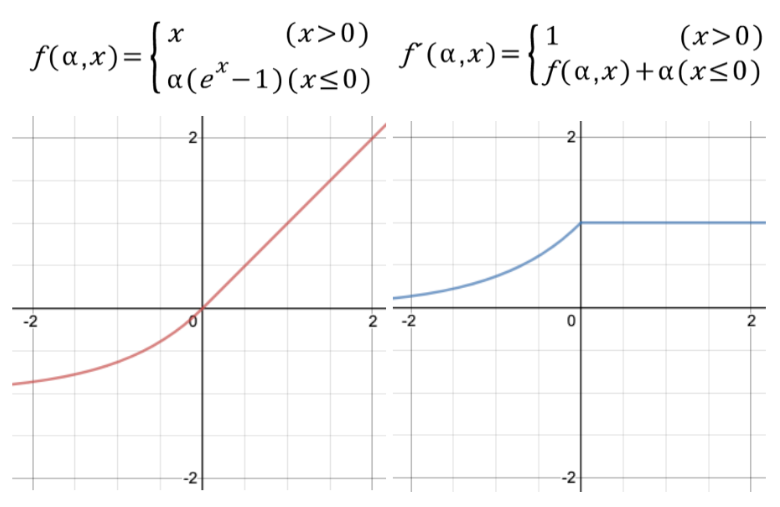

  

  * 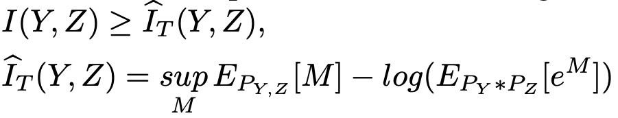
    * M is MIST estimator
    * 위의 수식은 Y와 Z의 mutual information을 estimate한다. 이를 Estimate하는 방법는 gradient descent를 통해 lower bound를 maximize하는 것이다. 
    * 따라서 이는 min-max problem으로 정의할 수 있다.
      * Lower bound maximizing + minimize mutual information
  * 위의 방법을 통해 F_prosody와 F_context의 mutual information을 최소화한다. (disentangle)
  * 이러한 MIST estimator 훈련 과정은 GAN과 유사한 방법이다. 

#### Prosody Distributor

* 목적: prosody exemplars를 이용해서 F_context와 결합된 prosody feature의 다양성을 풍부하게 함
  * 이때, prosody exemplar는 pretrained Prosody Extractor가 multiple reference speech를 이용하여 생성

* multi-head attention으로 구성

  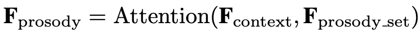

  * F_prosody_set : pretrained Prosody Extractor가 multiple reference speech를 이용하여 생성한 prosody exemplars
  * attention head = 4 , attention dimension = 384

#### Discriminator

* same structure with [Adversarially Trained End-to-end Korean Singing Voice Synthesis System](https://arxiv.org/pdf/1908.01919.pdf)

  > Expecting to generate a realistic sound, we adopted a conditional adversarial training method which helps the output distribution of Sˆ = SR(M, ˆ ·) be similar to the real data distribution S ∼ p(S|M). Intuitively, in the conditional adversarial training framework, discriminator Dψ not only tries to check if S is realistic but also the paired correspondence between S and M. Note that, we make a minor assumption that the distribution of Mˆ = MS(·) approximately follows that of M, that is, p(M) ' p(Mˆ ), allowing the joint training of two modules MS(·) and SR(·). The conditioning to discriminator was done by following [14] with a minor modification. First, the condition M is fed into a 1d-convolutional layer and the intermediate output of discriminator is fed into a 3×3 2d-convolutional layer. Then, inner product between the two outputs is done as a projection. Finally, the obtained scalar value is added to the last layer of Dψ resulting in final logit value. For the exact network configuration please refer to Figure 1. For the stable adversarial training, a regularization technique on Dψ has been proposed by several GAN related works [19, 20, 21, 15]. We adopted a simple, yet, effective gradient penalty technique called R1 regularization. This technique penalizes the squared 2-norm of the gradients of Dψ only when the sample from true distribution is taken as follows R1(ψ) = γ 2 Ep(M,S)[k∇Dψ(M, S)k 2 ]. (4) Note that the output of Dψ denotes the logit value before the sigmoid function. The final adversarial loss terms (LadvD and LadvG ) for Dψ and Gθ are as follows, LadvD (θ, ψ) = −Ep(M)[Ep(S|M)[f(Dψ(M, S))]] − Ep(Mˆ ) [f(Dψ((M, ˆ Sˆ))] + R1, LadvG (θ, ψ) = Ep(Mˆ ) [f(Dψ(M, ˆ Sˆ))], (5) where θ includes not only the parameters of SR but also that of MS, hence the two consecutive modules acting as one generator function Gθ = SR(MS(·), ·). The function f is chosen as follows f(t) = −log(1 + exp(−t)) resulting in the vanilla GAN loss as in the original GAN paper [22].

## Implementation

#### Pretraining 

* 3-steps warm-up strategy 
* 목적: train a general source model to get a prosody-cleaned Encoder and a stable Prosody Distributor

1. Prosody Extractor, Prosody Distributor, F_pitch 없이 vanilla model을 훈련 => prosody-cleaned Encoder

   * reconstruction loss + Structural Similarity loss(SSIM) + phone-level duration loss 
     * λ1 = 3.0, λ2= 1.0

   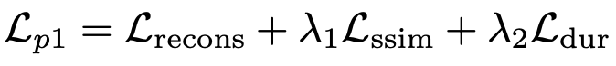

2. Prosody Extractor, F_pitch 추가

   * reloading and **fixing** parameters of the Encoder from the first step 
     * *1번에서 학습 끝낸 파라미터를 불러와서 그걸로 초기화해서 사용. Encoder는 더이상 업데이트하지 않음*
   * Prosody-only extractor를 훈련하기 위해 MIST estimator를 적용
   * P1 loss에 pitch loss, MIST estimator obejective 추가
     * λ1 = 2.0, λ2= 1.0, λ3= 1.0, λ4= 1.0

   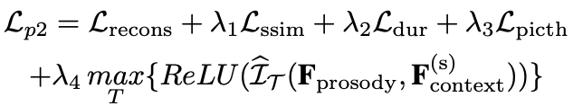

   * F_context^s = random sample of context feature, 각 training step 마다 mutual information을 구하기 위해 사용
   * MIST estimator 훈련 objective
     * mutual information lower bound maximizing
     * optimize 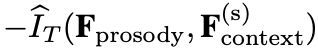
     * ReLU는 non-negative value를 얻기 위해 추가

3. Prosody distributor를 추가

   * 여기서도 앞단계에서 훈련한 Encoder, Prosody extractor, F_pitch를 freeze한 상태로 사용

   * 이는 stable한 distributor를 얻기 위함임

   * Loss function은 reconstruction error + SSIM error + duration error

     * λ1 = 1.0, λ2= 1.0

     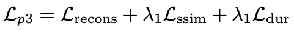

#### Fine-tuning

* Discriminator를 사용!

* pretrained한 모든 모델을 reloading하고 그 중 Prosody Extractor와 MIST estimator는 freeze

* Discriminator 훈련을 위해 WGAN-GP를 사용

  * discriminator는  optimize하도록 훈련한다.
  * 이때 L_gp는 gradient penalty regularization을 의미하고, β는 10으로 설정한다. 

* Fine-tuning stage의 loss function

  * Step 2 loss function에 adversarial loss를 더한 것과 같다.
    * λ1 = 3.0, λ2= 1.0, λ3= 0.1, λ4= 1.0, λ5= 0.1 * L_recons

  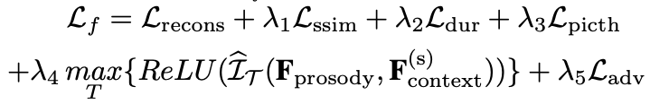

## Experiments

#### Datasets

* task와 pretrain, finetune에 따라 다르게 사용

  |                           | pretrain                                                     | finetune                                                    |
  | ------------------------- | ------------------------------------------------------------ | ----------------------------------------------------------- |
  | Expressive TTS            | Multi-speaker(40), Multi-style English + Chinese / 382,724 sents, 447.02h | Single speaker, multi(7) styles Chinese / 3920 sents, 4.02h |
  | Few-shot personalized TTS | Multi(450)-speaker, Single style English / 701,255 sents, 753.47h | 2 male , 2 female voices / 15 sents, 1 min for each voice   |

#### System 구성

* Baseline
  * FastSpeech2 + GST with conditional layer normalization
* Expressive TTS
  * Baseline과 Prosody speech 모두에 style embedding, role embedding 추가
  * ProsodySpeech: 특정 스타일에 해당하는 reference audio를 여러개 사용 (exemplar생성을 위해)
  * Baseline: reference audio로 paired content audio를 사용
* Few-shot personalized TTS
  * Baselien과 ProsodySpeech 모두 Conditional layer normalization과 speaker embedding과 관련된 parameter만 update(finetune)
  * ProsodySpeech: 모든 reference audio를 사용
  * Baseline: 훈련데이터에서 randomly select한 audio를 reference audio로 사용

* 그 외 학습 configuration
  * ADAM optimizer with lr = 0.5, beta = (0.9,0.998)
  * Noam's learning rate decay scheme
  * warmup steps = 8k
* MelGAN vocoder

## Results

* Linear-spectrogram 비교

  * sad, angry speech
  * Prosodyspeech의 spectrogram에서 high frequency harmonics가 더 잘 구현되고, fundamental frequency가 더 abundant and natural함을 알 수 있다.

  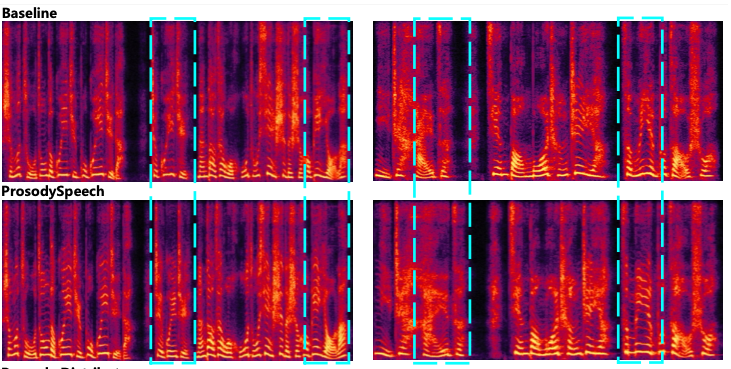

* attention head 비교

  * 왼쪽 : 거의 비슷한 reference audio하나를 줬을 때
  * 오른쪽: 다른 여러개의 reference audio를 줬을 때 

  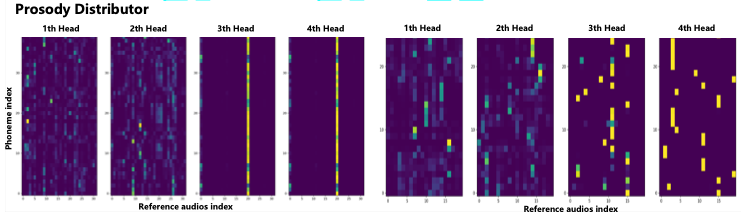

* Expressive TTS의 MOS score

  * style마다 75개의 문장을 20명의 평가자가 평가

  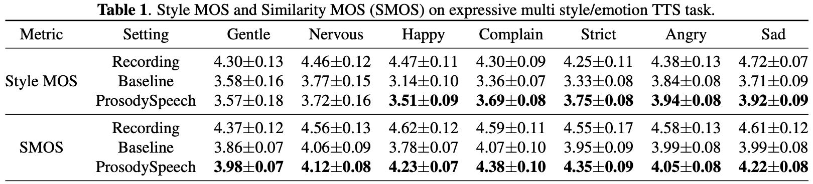

* Few-shot personalized TTS 

  * voice 마다 45개의 문장을 평가

  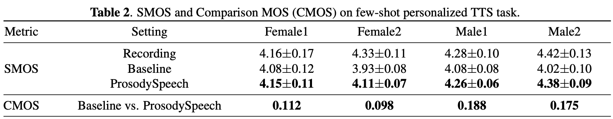

* Ablation Study

  * pitch를 없앴을 때가 제일 차이가 많이 난다.

  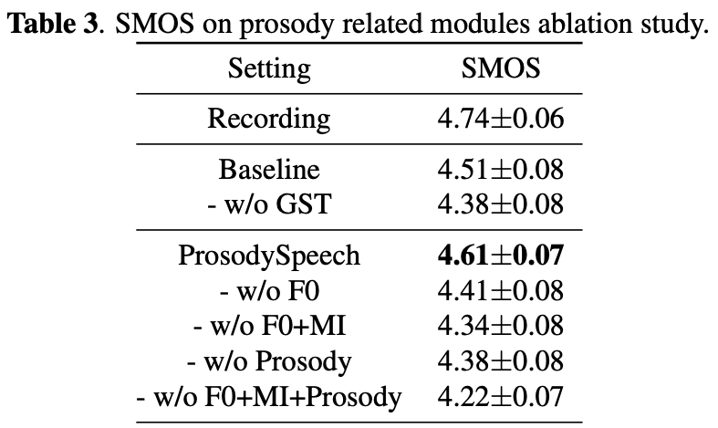

## Conclusion

* 본 논문에서는 high expressive를 생성하고 소량의 데이터로 개인화된 음성을 합성할 수 있는 advanced prosody modeling 방법을 탑재한 neural TTS모델 ProsodySpeech를 제안한다.
* ProsodySpeech는 원음과의 유사성, style 표현력, 그중에서도 특히 강도가 높은 style 음성에 대한 성능 향상을 확인하였다.
* 또한, 개인화된 음성합성에서도 원음과의 유사성과 자연성 면에서 좋은 성능을 보였다.

