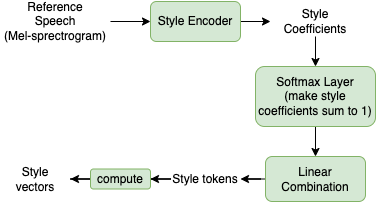
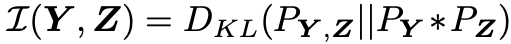
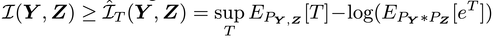
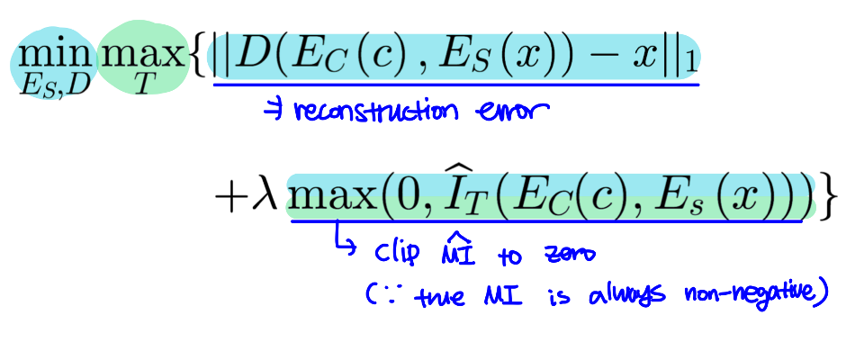
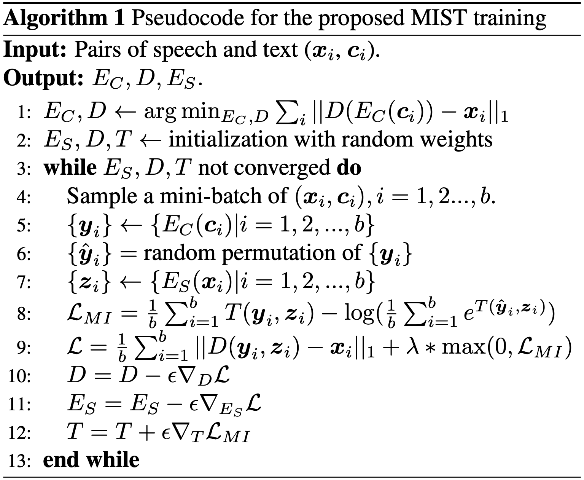

# Unsupervised Style and Content Separation by Minimizing Mutual Information for Speech Synthesis

* ICASSP 2020 accepted for presentation in a lecture session
* CMU, Apple
* [논문링크](https://arxiv.org/pdf/2003.06227.pdf)

## Overview

TTS에서 style transfer를 할 때 발생하는 content leakage 문제에 대한 해결방안을 제안한다. content 와 style의 mutual information을 예측하고 그것을 최소화하는 방법이다. mutual information의 lower bound를 최대화하고, 생성된 Mel-spectrogram의 reconstruction error와 estimated mutual information을 최소화한다. 

계속 동일한 내용(in Overview)이 반복되어 abstract과 introduction은 생략하고, 제안한 방법에 대한 설명으로 바로 들어간다.

## Proposed method

### Style vector 생성 과정

### Content encoder pretraining

* simple TTS train 과정
* 이때 데이터셋은 single style dataset
* Reconstruction error를 최소화한다.
* 이렇게 훈련한 content encoder는 freeze하고, speech decoder는 다시 random weight로 초기화한다.

### Mutual Information Neural Estimation (MINE)

* mutual information을 (Y,Z의 joint distribution)과 (y,z의 각 marginal distribution의 Product)의 KL divergence로 정의한다.

  

* 그리고, Donsker-Varadhan representation of KL divergence를 이용하여 Lower bound를 설정한다. 

  

  * T는 위의 식의 두 expectation을 finite하게 하는 함수면 어느 것이든 상관 없다.

### Style content separation with MI minimization

* 두가지 loss를 minimization + maximization of lower bound of MI
  * c: content vector, x: Mel-spectrogram of reference speech 
  * λ: 두가지 Loss를 balance하는 hyperparameter

### 총정리

* 6번에서 왜 random permutation of y_i 가 나오는지는 모르겠음

  